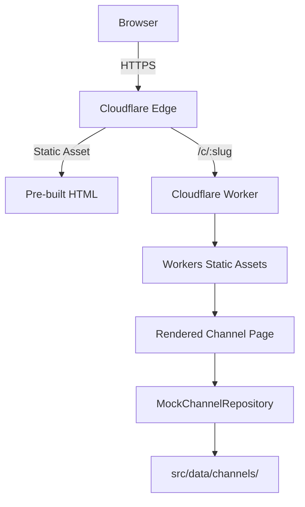

# Architecture

## System Overview



## Data Flow

1. **User** navigates to `/c/<slug>`
2. **Cloudflare Edge** serves the pre-built HTML (V1: fully static)
3. **Astro Islands** (QR code, Copy button) hydrate client-side as needed
4. **Channel data** is resolved at build time via `MockChannelRepository`

## Components

| Component        | Purpose                              | Hydration  |
|-----------------|--------------------------------------|------------|
| ChannelHero      | Avatar, badge, CTA buttons            | Static     |
| StatsBar         | Member count, frequency, status       | Static     |
| WhyJoin          | Highlight cards                       | Static     |
| FeaturedPost     | Promoted post display                 | Static     |
| ContentCard      | Recent content list                   | Static     |
| QRSection        | Canvas-generated QR code              | client:load|
| CopyButton       | Clipboard API integration             | client:load|
| FinalCTA         | Conversion section                    | Static     |
| SiteFooter       | Footer with demo indicator            | Static     |

## Future: TelegramChannelRepository Design

```ts
export class TelegramChannelRepository implements ChannelRepository {
  constructor(private token: string) {}

  async getBySlug(slug: string): Promise<Channel | null> {
    const response = await fetch(`https://api.telegram.org/bot${this.token}/getChat`, {
      method: 'POST',
      body: JSON.stringify({ chat_id: `@${slug}` }),
    });
    // ... map Telegram API response to Channel interface
  }

  async listAll(): Promise<Channel[]> {
    // Fetch from admin panel or Telegram bot data
    return [];
  }
}
```

> ⚠️ **Security**: `TELEGRAM_BOT_TOKEN` must be stored as a Cloudflare secret, never in source code.

## Security Boundaries

| Boundary             | Mechanism                    |
|---------------------|------------------------------|
| Middleware           | CSP, X-Content-Type-Options  |
| CI/CD               | GitHub secrets (API tokens)  |
| Deployment          | Cloudflare Account API       |
| Bot Token           | Cloudflare Secret Manager    |

## Caching Strategy

- **V1**: Fully static HTML — edge-cached via Cloudflare's global network. No TTL concerns.
- **Future V2+**: Dynamic routes will require cache headers (e.g., `Cache-Control: public, max-age=3600`) set in the worker response.
