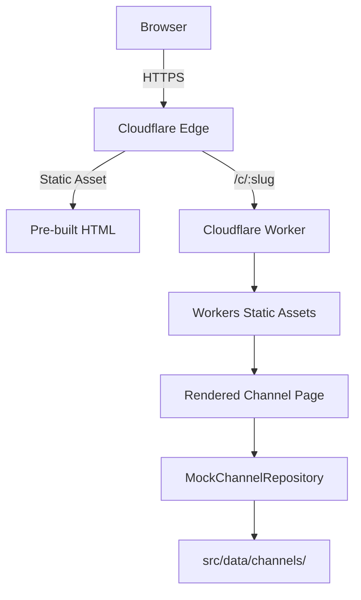

# Telegram Channel Landing Page Platform

A reusable platform for generating beautiful, SEO-optimized landing pages for Telegram channels — built with Astro + Cloudflare Workers.

## Live Demo

[View Demo](https://telegram-channel-landing.workers.dev)

## Tech Stack

| Layer          | Technology             |
| -------------- | ---------------------- |
| Framework      | Astro 5                |
| Styling        | Tailwind CSS v3        |
| Deployment     | Cloudflare Workers     |
| QR Codes       | qrcode                 |
| CI/CD          | GitHub Actions         |
| Testing        | Vitest                 |

## Local Development

```bash
# Install dependencies
npm install

# Start dev server
npm run dev

# Open http://localhost:4321
```

## Build & Deploy

```bash
# Build for production
npm run build

# Preview locally with Wrangler
npm run preview

# Deploy to Cloudflare Workers
npm run deploy
```

## Environment Variables

See `.env.example` for reference. No secrets are required for V1 (demo mode).

Future Telegram integration will require:
- `TELEGRAM_BOT_TOKEN` — stored as a Cloudflare secret (never in source)
- `CLOUDFLARE_ACCOUNT_ID` — used only in CI, stored as GitHub secret
- `CLOUDFLARE_API_TOKEN` — used only in CI, stored as GitHub secret

## Architecture



- **V1 is fully static**: No Worker is invoked per page view. Channel data is resolved at build time via `MockChannelRepository`.
- To add a real Telegram channel in V2, implement `TelegramChannelRepository` and store the bot token as a Cloudflare secret.

## Roadmap

| Version | Status | Description                                    |
| ------- | ------ | ---------------------------------------------- |
| V1      | ✅ Done | Static landing pages with mock data           |
| V2      | 🔄 Next | Dynamic channel data via Telegram API          |
| V3      | 🔜     | Multi-channel CMS admin panel                  |
| V4      | 🔜     | Analytics & engagement tracking                |
| V5      | 🔜     | Custom domains per channel                     |
| V6      | 🔜     | White-label deployment for agencies            |

## Security

- CSP, X-Content-Type-Options, and Referrer-Policy headers via middleware
- No secrets in source code
- GitHub secrets for CI/CD credentials

See [SECURITY.md](SECURITY.md) for details.

---

License: [MIT](LICENSE)
